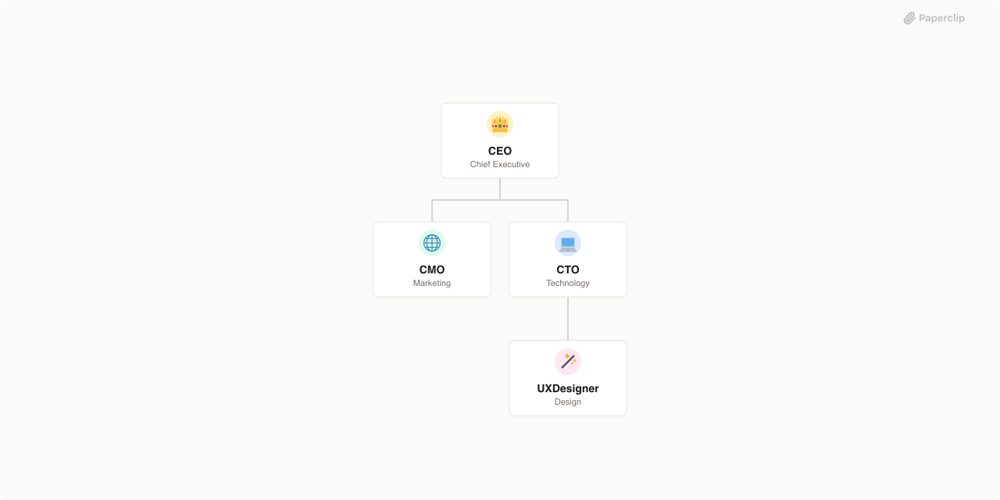

# AI hub



## What's Inside

> This is an [Agent Company](https://agentcompanies.io) package from [Paperclip](https://paperclip.ing)

| Content | Count |
|---------|-------|
| Agents | 14 |
| Projects | 1 |
| Skills | 34 |

### Agents

| Agent | Role | Reports To |
|-------|------|------------|
| CEO | CEO | — |
| Product Manager | Product | ceo |
| CMO | CMO | ceo |
| Head of Sales | Sales | ceo |
| CTO | CTO | ceo |
| Content Writer | Marketing | cmo |
| Content Strategist | Veille & Engagement | cmo |
| Full-Stack Developer | Engineering | cto |
| UX Designer | Design | cto |
| QA Engineer | Quality Assurance | cto |
| DevOps Engineer | Infrastructure | cto |
| Agent Debugger | Engineering | cto |
| SDR | Sales | head-of-sales |
| CSM | Customer Success | head-of-sales |

### Org Chart

```
CEO
├── Product Manager
├── CMO
│   ├── Content Writer
│   └── Content Strategist
├── CTO
│   ├── Full-Stack Developer
│   ├── UX Designer
│   ├── QA Engineer
│   ├── DevOps Engineer
│   └── Agent Debugger
└── Head of Sales
    ├── SDR
    └── CSM
```

### Projects

- **Onboarding**

### Skills

**Platform:**

| Skill | Description | Source |
|-------|-------------|--------|
| paperclip | Core orchestration and task management | [github](https://github.com/paperclipai/paperclip/tree/master/skills/paperclip) |
| paperclip-create-agent | Create new agents | [github](https://github.com/paperclipai/paperclip/tree/master/skills/paperclip-create-agent) |
| paperclip-create-plugin | Create plugins/extensions | [github](https://github.com/paperclipai/paperclip/tree/master/skills/paperclip-create-plugin) |
| para-memory-files | PARA-based memory system | [github](https://github.com/paperclipai/paperclip/tree/master/skills/para-memory-files) |
| prompt-optimizer | Prompt analysis and optimization | [github](https://github.com/affaan-m/everything-claude-code) |
| ceo-advisor | Executive leadership guidance | [github](https://github.com/alirezarezvani/claude-skills) |
| cto-advisor | Technical leadership guidance | [github](https://github.com/alirezarezvani/claude-skills) |
| ui-ux-pro-max | UI/UX design intelligence | [github](https://github.com/nextlevelbuilder/ui-ux-pro-max-skill) |

**Custom (LinkedIn/CRM via Unipile):**

| Skill | Description | Used by |
|-------|-------------|---------|
| linkedin-search | Search LinkedIn for people, companies, posts | SDR, Head of Sales, Content Strategist |
| linkedin-connect | Send connection requests with personalization | SDR |
| linkedin-dm | Send direct messages, manage conversations | SDR, CSM |
| linkedin-post | Create and publish LinkedIn content | Content Writer |
| linkedin-engage | Like and comment on LinkedIn posts | Content Strategist |
| crm-pipeline | Read/interact with SonorIA CRM pipeline | SDR, CSM, Head of Sales |

**Installed (skills.sh):**

| Skill | Description | Used by | Source |
|-------|-------------|---------|--------|
| product-management | Founder-PM toolkit: discovery, roadmaps, prioritization | Product | [skills.sh](https://skills.sh/vasilyu1983/ai-agents-public/product-management) |
| product-manager-toolkit | RICE, interview analysis, PRD templates | Product | [skills.sh](https://skills.sh/alirezarezvani/claude-skills/product-manager-toolkit) |
| competitive-intelligence | Competitor research, battlecards | CEO, Product | [skills.sh](https://skills.sh/anthropics/knowledge-work-plugins/competitive-intelligence) |
| competitive-teardown | Feature comparison, SWOT, positioning maps | Product | [skills.sh](https://skills.sh/alirezarezvani/claude-skills/competitive-teardown) |
| growth-strategy | GTM, SEO/CRO, growth loops | CMO | [skills.sh](https://skills.sh/manojbajaj95/claude-gtm-plugin/growth-strategy) |
| linkedin-posts | LinkedIn post writing, hooks, engagement | Content Writer | [skills.sh](https://skills.sh/kostja94/marketing-skills/linkedin-posts) |
| seo-content-strategist | SEO content strategy for SaaS | Content Writer | [skills.sh](https://skills.sh/ncklrs/startup-os-skills/seo-content-strategist) |
| pricing-strategy | SaaS pricing, tiers, billing models | Head of Sales | [skills.sh](https://skills.sh/credyt/ai-skills/pricing-strategy) |
| ai-cold-outreach | AI outreach systems, personalization at scale | SDR | [skills.sh](https://skills.sh/chadboyda/agent-gtm-skills/ai-cold-outreach) |
| ai-sdr | AI SDR deployment, qualification automation | SDR | [skills.sh](https://skills.sh/chadboyda/agent-gtm-skills/ai-sdr) |
| lead-qualification-bant | BANT framework, discovery questions, scoring | SDR | [skills.sh](https://skills.sh/guia-matthieu/clawfu-skills/lead-qualification-bant) |
| customer-success | Onboarding, health scoring, retention | CSM | [skills.sh](https://skills.sh/claude-office-skills/skills/customer-success) |
| code-review-quality | Context-driven code reviews, testability | CTO | [skills.sh](https://skills.sh/proffesor-for-testing/agentic-qe/code-review-quality) |
| devops-automation | CI/CD, monitoring, incident management | DevOps | [skills.sh](https://skills.sh/claude-office-skills/skills/devops-automation) |
| devops-cicd | Pipelines, IaC, deployment strategies | DevOps | [skills.sh](https://skills.sh/miles990/claude-software-skills/devops-cicd) |
| qa-test-planner | Test plans, E2E testing, regression | QA Engineer | [skills.sh](https://skills.sh/softaworks/agent-toolkit/qa-test-planner) |
| social-listening | Brand monitoring, keyword tracking, sentiment analysis | Content Strategist | [skills.sh](https://skills.sh/guia-matthieu/clawfu-skills/social-listening) |
| content-strategy | Joe Pulizzi methodology, content pillars, editorial calendar | CMO | [skills.sh](https://skills.sh/guia-matthieu/clawfu-skills/content-strategy) |
| github | GitHub issues, PRs, reviews, labels, milestones | CTO, Full-Stack Dev, DevOps | [skills.sh](https://skills.sh/callstackincubator/agent-skills/github) |
| git-workflow | Branching, conventional commits, merge strategy | CTO, Full-Stack Dev | [skills.sh](https://skills.sh/affaan-m/everything-claude-code/git-workflow) |
| github-actions-expert | Ecrire et debugger des workflows CI/CD | DevOps | [skills.sh](https://skills.sh/cin12211/orca-q/github-actions-expert) |

## Getting Started

```bash
pnpm paperclipai company import this-github-url-or-folder
```

See [Paperclip](https://paperclip.ing) for more information.

---
Exported from [Paperclip](https://paperclip.ing) on 2026-04-13
